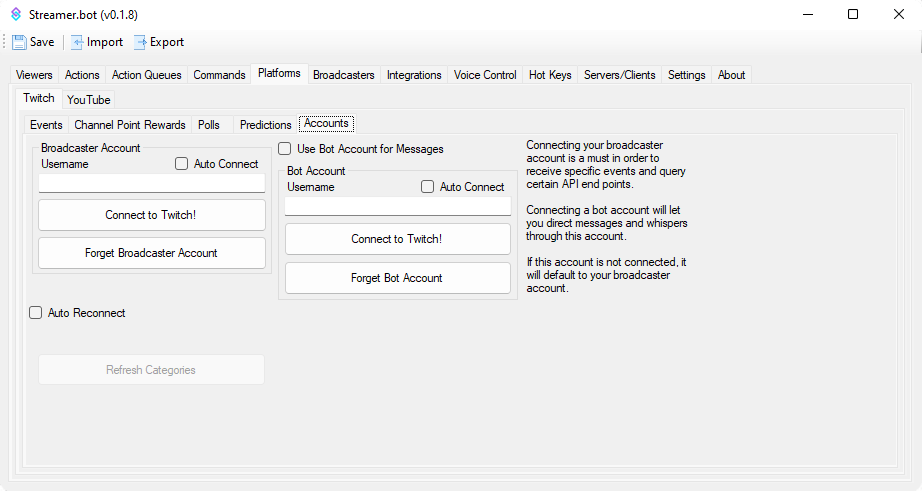

# Twitch Quick Start
Connect your Twitch account to Streamer.bot

{width=600}

1. Navigate through the following: `Platforms` ---> `Twitch` ----> `Accounts`
2. Press the `Connect to Twitch` button to bring up an authorization webpage that will detail all the permissions **Streamer.bot** wants to have access to on your behalf

### Broadcaster Account

If you want Streamer.bot to be able to monitor chat and Twitch events, a `Broadcaster` account must be defined.

Press `Connect to Twitch` to automatically obtain a token. If you are already logged in on your web browser you will be taken immediately to the permissions screen. This is a list of all the Twitch features the application will be able to perform in your name. If it is not listed here, the bot can't do it, even if you could perform an action by typing a command in chat yourself for example.

> `Auto Connect` will set **Streamer.bot** to connect to Twitch! with the defined account on startup
{.is-success}

### Bot Account

You might wish for messages sent to chat to be sent from a separate user account.
You can log in to a secondary account here the same way as the Broadcaster account.

The account can be any standard Twitch account but with the permission scope the application requests it can not listen to incoming events or messages, it can only send messages to chat or whisper.

::alert{type=success icon=mdi:check-circle}
Enable `Auto Connect` to automatically connect to **Twitch** on startup
::

::list{type=success}
- Visit the [Twitch Configuration Guide](/config/platforms/twitch) to learn more about all options!
::