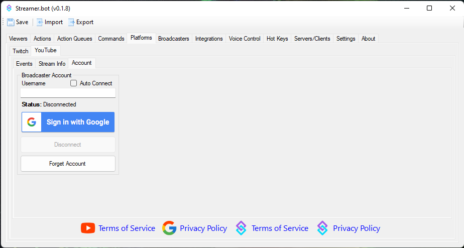

# YouTube Quick Start
Connect your YouTube account with Streamer.bot

{width=600}

## Connect a Broadcaster Account
The broadcaster account is your primary YouTube account where you host your stream.

This account is **required** for Streamer.bot to monitor chat and events from YouTube.

::list{type=warning}
- *The username field is not editable. Your authenticated username will display here once you have signed in.*
::

1. In Streamer.bot, navigate to `Platforms -> YouTube -> Accounts`
2. Press the `Sign in with Google` button authenticate your Google account with Streamer.bot
    - You can review all permissions granted to Streamer.bot on the next screen
3. Enable `Auto Connect` to automatically connect to your YouTube account on startup

::list{type=success}
- Visit the [YouTube Configuration Guide](/guide/platforms/youtube) to learn more about all options!
::

---

::disclosure{type=warning icon=mdi:alert}
#summary
If you stream from a **brand account**, click here!

#content
**The proper permissions will not be granted if you select the brand account on the first screen.**

You must first sign in to the primary YouTube account which has **ownership** of the brand account.

You will then be able to select from owned brand accounts on a second screen.
::