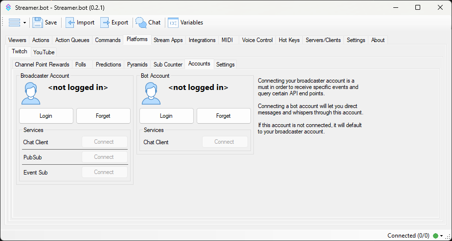
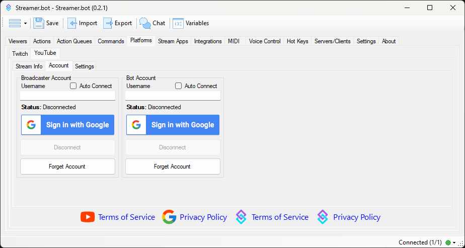

## Overview
To get started with Streamer.bot, you first need to connect your bot to your streaming **platform** (e.g. Twitch or YouTube), as well as your **broadcaster** software (e.g. OBS Studio or Streamlabs Desktop).

If you are new to local bots and want to learn about the bot while installing some pre-configured (but still awesome) content then you might want to take a quick side trip to [VRFlad's Fasttrack](https://vrflad.com/fasttrack). Don't worry, the wiki will be here when you get back.

For the more advanced users that want to start off with a clean slate and start building, then by all means... read on!

## Platforms
Connect your streaming platform account(s) to enable Streamer.bot to receive events and perform actions such as sending messages to your chat.

Streamer.bot supports both **Twitch** and **YouTube** as streaming platforms.

::card-group
  ::card{icon="i-mdi-twitch" to="#twitch-setup" title=Twitch}
  Connect your Twitch account to Streamer.bot
  ::
  ::card{icon="i-mdi-youtube" to=#youtube-setup title=YouTube}
  Connect your YouTube account to Streamer.bot
  ::
::

### Twitch Setup
Connect your Twitch account to Streamer.bot

{width=600}

1. Navigate through the following: `Platforms` ---> `Twitch` ----> `Accounts`
2. Press the `Connect to Twitch` button to bring up an authorization webpage that will detail all the permissions **Streamer.bot** wants to have access to on your behalf

#### Broadcaster Account

If you want Streamer.bot to be able to monitor chat and Twitch events, a `Broadcaster` account must be defined.

Press `Connect to Twitch` to automatically obtain a token. If you are already logged in on your web browser you will be taken immediately to the permissions screen. This is a list of all the Twitch features the application will be able to perform in your name. If it is not listed here, the bot can't do it, even if you could perform an action by typing a command in chat yourself for example.

> `Auto Connect` will set **Streamer.bot** to connect to Twitch! with the defined account on startup
{.is-success}

#### Bot Account

You might wish for messages sent to chat to be sent from a separate user account.
You can log in to a secondary account here the same way as the Broadcaster account.

The account can be any standard Twitch account but with the permission scope the application requests it can not listen to incoming events or messages, it can only send messages to chat or whisper.

::callout{color=green icon=i-mdi-check-circle}
Enable `Auto Connect` to automatically connect to **Twitch** on startup
::

::list{type=success}
- Visit the [Twitch Configuration Guide](/guide/platforms/twitch) to learn more about all options!
::

### YouTube Setup
Connect your YouTube account with Streamer.bot

{width=600}

#### Broadcaster Account
The broadcaster account is your primary YouTube account where you host your stream.

This account is **required** for Streamer.bot to monitor chat and events from YouTube.

::list{type=warning}
- *The username field is not editable. Your authenticated username will display here once you have signed in.*
::

1. In Streamer.bot, navigate to `Platforms -> YouTube -> Accounts`
2. Press the `Sign in with Google` button authenticate your Google account with Streamer.bot
    - You can review all permissions granted to Streamer.bot on the next screen
3. Enable `Auto Connect` to automatically connect to your YouTube account on startup

::list{type=success}
- Visit the [YouTube Configuration Guide](/guide/platforms/youtube) to learn more about all options!
::

---

::callout{color=amber icon=i-mdi-alert}
**If you stream from a brand account:** the proper permissions will not be granted if you select the brand account on the first screen.
You must first sign in to the primary YouTube account which has **ownership** of the brand account.
You will then be able to select from owned brand accounts on the following screen.
::

## Broadcasters
Set up your broadcasting software to work with Streamer.bot

::card-group
  ::card{icon="simple-icons:obsstudio" title="OBS Studio" to=#obs-studio}
  Take control of your OBS Studio instance(s) with Streamer.bot
  ::
  ::card{icon="IconStreamlabsDesktop" title="Streamlabs Desktop" to=#streamlabs-desktop}
  Control Streamlabs Desktop with Streamer.bot
  ::
::

::list{class=mt-5}
- **[OBS Studio](/get-started/broadcasters/obs-studio) is highly recommended** and provdies the most functionality
- Visit the [Configuration Guide](/guide) to learn more about other broadcaster options.
::

### OBS Studio
Set up Streamer.bot to remotely control your [OBS Studio](https://obsproject.com) instance

::disclosure{type=info}
This guide assumes you are running **OBS Studio** version `28` or later

#content
In OBS Studio version `28`, the OBS WebSocket plugin was added to the core application. With this change came a new version of the WebSocket protocol.

Streamer.bot supports **both** OBS WebSocket `v4.9.*` and the latest `v5`

If you are running **OBS Studio** version `<28` or OBS WebSocket version `4.9`, refer to the full [OBS Configuration Guide](/guide/broadcasters/obs-studio)
::

#### Prerequisites
*If you are running **OBS 28 or higher** the WebSocket Plugin is pre-installed and the settings can be found on the top bar under Tools.*

*If you don't see the websocket settings and you have **OBS 28+**, go to Help > Verify Files*

To enable remote control of your **OBS Studio** instance from **Streamer.bot** you must first install the OBS WebSocket Plugin

- [**Download OBS WebSocket *<i class="mdi mdi-github"></i> obs-websocket v5+***](https://github.com/obsproject/obs-websocket/releases/tag/5.0.1)
{.btn-grid .my-5}

After installing the plugin and restarting OBS, you should be able to configure your WebSocket Server settings as you wish:

Later, you will need to match these settings in Streamer.bot

#### Configuration
Once configured, connected OBS sessions will report their status on the OBS tab in Streamer.bot

To add a new connection, <kbd>Right-Click</kbd> <kbd>-></kbd> <kbd>Add</kbd> to open the new connection dialogue

Configuration options are explained in more detail [here](/guide/broadcasters/obs-studio)

::callout{color=amber icon=i-mdi-alert}
If OBS isn't connecting, please double check the **PORT, PASSWORD and VERSION** to ensure that data is correct.
::

### Streamlabs Desktop
Set up Streamer.bot to remotely control your Streamlabs Desktop instance

#### Prerequisites

Obtain your **API Token** and **Port** from your Streamlabs Desktop settings.

Later, you will need to match these settings in Streamer.bot

#### Configuration

Streamlabs Desktop configuration can be found by navigating to the following tabs in Streamer.bot:
`Broadcasters` -> `Streamlabs Desktop`

To add a new connection, <kbd>Right-Click</kbd> -> <kbd>Add</kbd> to open the new connection dialogue.

Configuration options are explained in more detail [here](/guide/broadcasters/streamlabs-desktop)
