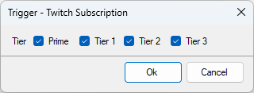
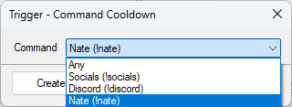
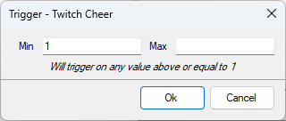
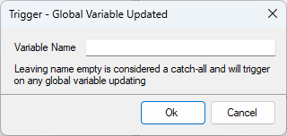
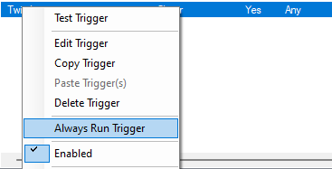
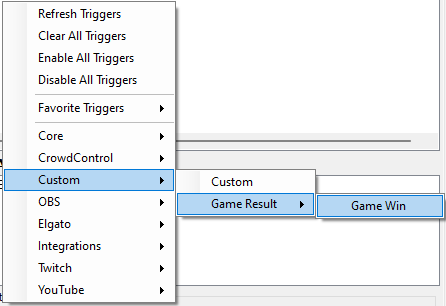

::callout{icon=i-mdi-bookmark color=green to=/api/triggers}
Explore all available triggers in the [Triggers API References](/api/triggers)
::

## Introduction

Since the version bump to Streamer.bot 0.2.X the `Events` tab was replaced with a `Triggers` window. This allows to have more control on what happens when these events are triggered. This is because you can now have several actions trigger rather than just one when an event such as a **Twitch Follow** occurs.

## Guide

They are several different types of triggers with different settings/criteria that allow you more control on how they again to give you more customization options, below is an explanation of the types of triggers that we have in Streamer.bot.

### Basic Triggers

`Basic Triggers`, characterized by their innate simplicity, require no additional settings or criteria. They are designed to work effortlessly out of the box, and this category includes triggers such as `Streamer.bot Started` `Streamdeck Connected` and `YouTube User Banned`.

### Checkbox Triggers



`Checkbox Triggers` have settings controlled by checkboxes as you can see here with the `Twitch Subscription`. You will need to uncheck the boxes for the settings you want to turn off, in this example unticking *Tier 2* and *Tier 3* will allow you to create and alert for just *Prime* and *Tier 1* subscriptions. Having all the boxes will make it an `Any` trigger.

### Dropdown Triggers



`Dropdown Triggers` include a dropdown menu. Many triggers have this option but all you need to do is to select the option you want and it will trigger on that selection. You can also select `Any` here this will make it an `Any` Trigger.

### Range Triggers



`Range Triggers` for things such as `Twitch Cheers` will allow you to have different triggers based on the amount that was given. 

Setting a `Min` and `Max` will trigger the action if it is between the 2 given numbers inclusively (meaning including the Min and Max).

Just setting a `Min` will trigger the action if the amount is greater or equal to the number given.

Just setting a `Max` will trigger the action.

Leaving both `Min` and `Max` blank will turn it into an `Any` trigger.

### Text Box Triggers



`Text Box Triggers` as the name suggests have a textbox on them, these will allow you to enter data to control the effect this trigger has, its used in things such as `First Words` where you can enter a username and it will only trigger when that user speaks. It is also seen in the `OBS Scene Changed` so you can control what happens when you change to a certain scene. It is also seen as shown on the `Global Variable Updated` where you can run an action when a specific variable updates. Leaving this blank will treat this as an `Any` trigger.  

### Any and Always Run

`Any` are triggers that will trigger on all the event regardless of the criteria settings given, for example for `Twitch Cheer` if its set as an `Any` no matter the amount this will trigger.



`Always Run` is a setting that will control if this `Any` triggers runs, this will control if the trigger runs when there is also a criteria set on it. This means if you had an action to trigger on any `Twitch Cheer` and you had a second action that trigger just on a `100 Bits Twitch Cheer`. If someone was to cheer 100 Bits then if `Always Run` is checked then the `Any` Action will run along with the 100 Bits Action, if its unchecked the `Any` Action will not run and just the 100 Bits Action will run.

You can recognize a `Any` Trigger by its blue color, when always run is disabled it will go to the standard black.

### Custom Triggers

Custom Triggers allow you to create your own triggers in Streamer.bot, they do require C# but they can be easily added. 

This code will allow you to add the following trigger.

```cs
CPH.RegisterCustomTrigger("Game Win", "gameResultWin", new[]{"Game Result"});

```


Then you can trigger it with this code.

```cs
CPH.TriggerCodeEvent("gameResultWin", true);
```

You can find out more about custom triggers by visiting the Custom Trigger page.

::list{type=warning}

- Some triggers will have a mix of 2 or more of these types so you may need to visit the triggers dedicated page to find out more about that specific trigger.

::
