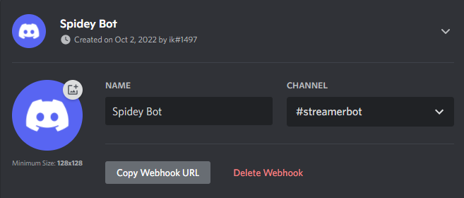

# Discord Integration
Integrate Streamer.bot with [Discord](https://discord.com) via webhooks

Webhooks allow you to send messages to your Discord server(s) with ease.

## Setup
1. In any Discord server where you have access to webhooks, select `Edit Channel` on the channel you wish to send messages to
2. Within channel settings, navigate to the `Integrations` tab
4. Click `Create Webhook`
5. Click the `Copy Webhook URL` button to get your Webhook URL

## Usage
You can now use the [Discord Basic Webhook](/api/sub-actions/integrations/discord/basic-webhook) sub-action.