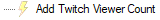

# Add Viewer Count
Populate a variable with your current Twitch viewer count.

## Variables
The following variables will be populated after executing this sub-action:

Name | Description | Example
----:|:------------|:--------|
`viewerCount` | Your current Twitch viewer count. | `12`

## C# Usage

::list{type=danger}
- C# method does not exist for this sub-action
::